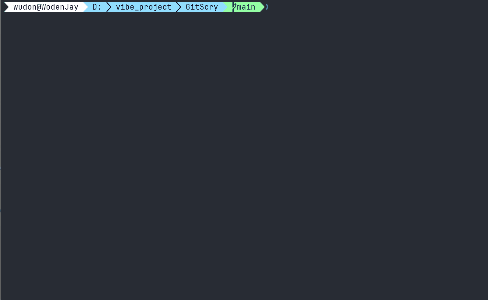

<div align="center">


# GitScry

**Give developers and coding agents a memory of how a codebase evolved.**

Find how similar changes were implemented before, why code looks the way it does, which tests tend to move with a file, what approaches failed, and which change may have introduced a bug — directly from local Git history.

</div>

## See it in action

GitScry turns repository history into answers you can use while implementing, debugging, and reviewing code.

<div align="center">
  
</div>

### Find precedent before making a change

```text
$ gitscry examples "cache update" --path src/cache/mod.rs --limit 3

Historical examples (52 matches):
- 5025dd61e230 refactor(cache): centralize memory opening
  step: update src/app/query.rs
  step: update src/cache/mod.rs
  confidence: high

- 278e915d9e08 fix(cache): rehydrate partial history
  step: update src/cache/mod.rs
  step: update src/git/history.rs
  confidence: high

- 82b4fde17dc2 feat(cache): compact cache payloads
  step: update src/analysis/retrieval/history.rs
  step: update src/cache/mod.rs
  step: update src/cache/payload.rs
  ...
  confidence: high
```

### Trace a fix back to the change that introduced it

```text
$ gitscry trace-fix 278e915d9e08 --path src/cache/mod.rs --limit 3

Fix lineage (1 match):
- 8c4e37e2fbab feat(cache): add safe refresh lifecycle
  trace: introducing change at fix 278e915d9e08...
  deleted line: 298
  path: src/cache/mod.rs
  confidence: medium
  commit: 278e915d9e08 fix(cache): rehydrate partial history (fix)
```

### Find tests that historically move with the code you changed

```text
$ gitscry tests src/app/update.rs --limit 3

Historical test candidates (1 match):
- candidate path: tests/cli_contract.rs
  co-change count: 1
  proportion: 100.0%
  supporting commit: 085783099752 feat(update): add self-update command
  confidence: medium
```

These examples are from GitScry's own repository history.

## What GitScry answers

Instead of manually stitching together `git log`, `blame`, old diffs, reverts, and path history, GitScry provides purpose-built queries for questions such as:

- **How was a similar change implemented before?** → `examples`
- **Why does this line or symbol exist?** → `why`
- **Which files historically change together?** → `related`
- **Which tests should I inspect for this change?** → `tests`
- **Was this approach tried and abandoned before?** → `failures`
- **Which commit may have introduced this regression?** → `regression`
- **What change originally introduced the code removed by this fix?** → `trace-fix`
- **What history is relevant to this topic?** → `search`

Results stay traceable: GitScry shows the commits, paths, confidence, and evidence behind each finding.

GitScry is local by design. It builds a rebuildable cache from your local repository history; Git remains the source of truth.

## Installation

```bash
# Windows
powershell -ExecutionPolicy Bypass -c "irm https://github.com/WodenJay/GitScry/releases/latest/download/gitscry-installer.ps1 | iex"

# Linux/macOS
curl --proto '=https' --tlsv1.2 -LsSf https://github.com/WodenJay/GitScry/releases/latest/download/gitscry-installer.sh | sh

# Cargo
cargo install gitscry
```

Don't want to install manually? Copy this and paste it to your coding agent:

```text
Read https://github.com/WodenJay/GitScry/blob/main/docs/INSTALL.md to install GitScry.
```

Or download the latest prebuilt binary from [GitHub Releases](https://github.com/WodenJay/GitScry/releases/latest).

## Quick start

```bash
cd your-project

gitscry index

# Find similar past implementations
gitscry examples "retry backoff"

# Understand why code exists
gitscry why src/lib.rs --line 42

# Find tests historically coupled to your change
gitscry tests src/lib.rs
```

`gitscry index` builds the local cache from the repository's default-branch history. Run it again whenever you want to refresh the cache.

## Coding agent integration

Add this to `AGENTS.md`:

```text
Use GitScry when past changes may help you understand, implement, or debug code. Skip it when history is irrelevant; see `gitscry --help`.
```

GitScry is designed to give coding agents access to implementation context that is usually left buried in repository history.

## Benchmark

| Command | Repository | Test command | Result |
|---|---|---|---|
| `search` | `NousResearch/hermes-agent` | `gitscry search "stealth ox-alpha model catalog" --limit 5` | Both relevant prior changes ranked in the Top 5 (ranks 3 and 4). |
| `examples` | `curl/curl` | `gitscry examples "digest quote the digest-uri param as well" --limit 5` | Matching precedent ranked #2; shared source file cited. |
| `tests` | `NousResearch/hermes-agent` | `gitscry tests agent/reasoning_timeouts.py --limit 5` | Relevant test file ranked #1. |
| `related` | `git/git` | `gitscry related builtin/gc.c --limit 5` | Related test file ranked #1. |
| `regression` | `git/git` | `gitscry regression "worktree add dwim when b or B is given" --path builtin/worktree.c --good <good-revision> --bad <bad-revision> --limit 5` | Relevant change ranked #2. |
| `why` | `git/git` | `gitscry why builtin/name-rev.c --line 99 --at <historical-revision> --limit 5` | Correct explanation ranked #1. |
| `trace-fix` | `rust-lang/rust` | `gitscry trace-fix <fix-commit> --path library/stdarch/crates/core_arch/src/x86/avx2.rs --limit 5` | Introducing change ranked #2. |

## Commands

| Command | What it tells you | Example |
|---|---|---|
| **`search`** | General-purpose history search across commit subjects, bodies, and touched paths when no specialized query fits. | `gitscry search retry backoff` |
| **`examples`** | Finds previous implementations of a similar change or migration and reconstructs the files and change steps involved. Changes that were later reverted are demoted rather than presented as good precedents. | `gitscry examples retire provider --path src/lib.rs` |
| **`failures`** | Finds approaches that were abandoned or reverted, together with the recorded reason and retry conditions when history contains them. | `gitscry failures provider normalization` |
| **`related`** | Finds files that historically changed together with the files you are editing. Candidates are ranked from actual co-change history rather than filename similarity. | `gitscry related src/cli.rs src/render.rs` |
| **`tests`** | Finds existing test files that historically changed alongside the code you are modifying. | `gitscry tests src/lib.rs` |
| **`regression`** | Ranks commits that may have introduced an observed regression using affected-path history, symptom matches, diff hunks, symbols, test history, and an optional good→bad revision range. | `gitscry regression slow startup --path src/main.rs --good v0.1.0 --symbol main` |
| **`why`** | Explains the history behind a specific line or symbol by tracing blame, diffs, path history, renames, and explanatory commit messages. | `gitscry why src/lib.rs --symbol provider` |
| **`trace-fix`** | Starts from a known fix and traces deleted/replaced lines back to the change that introduced them. | `gitscry trace-fix HEAD --path src/lib.rs` |
| **`index`** | Builds or refreshes the local cache from the repository's default-branch history. | `gitscry index` |
| **`update`** | Updates GitScry to the latest stable release. | `gitscry update` |

Use `gitscry --help` to learn more.

## License

GitScry is available under the [MIT License](LICENSE).

[GitHub repository](https://github.com/WodenJay/GitScry) · [crates.io package](https://crates.io/crates/gitscry)
